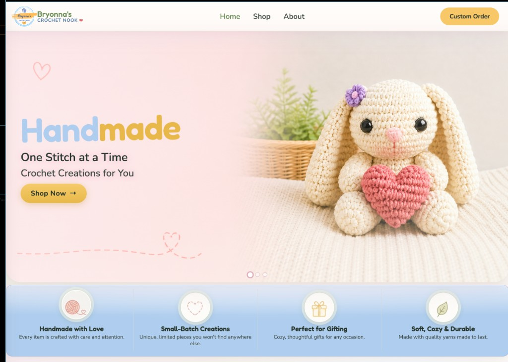

# Bryonna's Crochet Nook

Handmade crochet storefront: shop categories, about/events, and a custom-order flow. The **customer-facing site** is the React + Vite app in `frontend/`.



## Stack

| Area | Technology |
|------|------------|
| UI | React 18, Vite |
| Styling | Plain CSS (`frontend/src/styles.css`) |
| Routing | Hash routes (`#/`, `#/shop`, `#/about`, `#/customorder`) |
| Custom orders | Formspree (endpoint in `frontend/src/App.jsx`) |
| Optional API | Django in `backend/` (Docker Compose) |

## Repository layout

- **`frontend/`** — primary app; build output is `frontend/dist`
- **`backend/`** — Django API/admin (optional for full stack)
- **`bcnimg/`**, **`frontend/public/bcnimg/`** — product and UI images
- **`.github/workflows/deploy-pages.yml`** — GitHub Actions → GitHub Pages

## Local development

### Frontend (recommended for UI work)

```bash
cd frontend
npm ci
npm run dev
```

Open `http://localhost:5173`.

### Full stack with Docker

```bash
docker compose up --build
```

- Frontend: `http://localhost:5173`
- Backend: `http://localhost:8000`

## Deploy to GitHub Pages

Pushes to **`main`** run `.github/workflows/deploy-pages.yml`, which builds `frontend/` and publishes **`frontend/dist`**.

### One-time GitHub setting

In the repo on GitHub: **Settings → Pages → Build and deployment → Source: GitHub Actions**.

If Source is still “Deploy from a branch,” the Actions artifact will not go live and the site can look stale or broken.

### Production asset paths

`frontend/vite.config.js` sets `base: "/"` so JS/CSS load from the site root. That matches a **custom domain at the apex** (for example `https://bryonnascrochetnook.com/`). If you ever deploy only under `https://<user>.github.io/<repo>/`, set `base` to `"/<repo>/"` instead and rebuild.

### Verify the live build

After a green workflow run, the deployed `index.html` should reference script tags like `/assets/...`, not `/BryonnasCrochetNook/assets/...` (the latter causes 404s on a custom domain).

## Documentation

- **`GITHUB_SETUP.md`** — clone, remotes, Pages, and troubleshooting

## Changing custom-order emails

1. Adjust the form in the Formspree dashboard.
2. If the form id changes, update `FORMSPREE_CUSTOM_ORDER_URL` in `frontend/src/App.jsx`.

## Legacy paths

Older Django templates and static exports may still exist in the tree for reference; the **source of truth for the live storefront** is `frontend/`.
